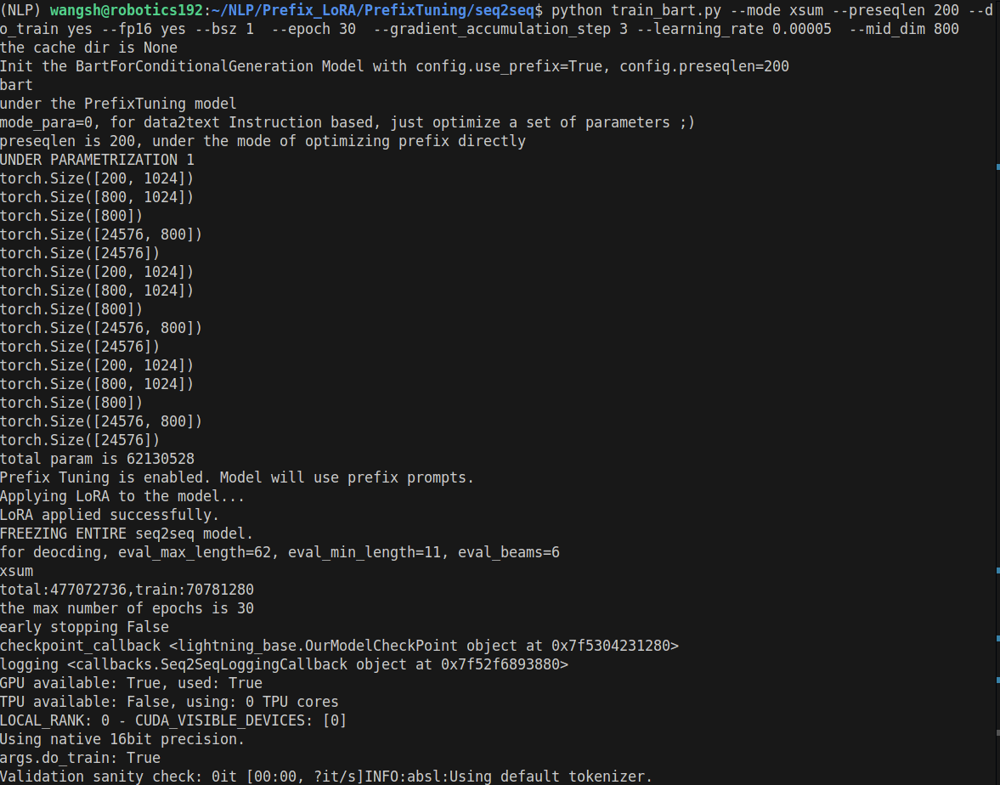
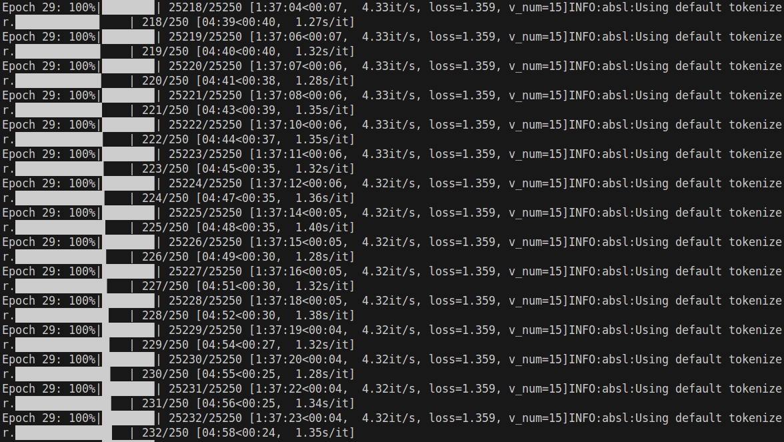

# Prefix-LoRA: Combining Prefix Tuning with LoRA

- (脚本部分参考自 https://github.com/XiangLi1999/PrefixTuning.git)
-----------------------------------------------------
## Prerequisites:
- Python 3.8
- Pytorch-lightning 1.0
- Pytorch
  
## Setup:

``cd transformer; pip install -e .; Download xsum dataset``

-----------------------------------------------------
# Train
## Train via Hybrid Method:
```python
cd seq2seq; 

python train_bart.py --use_prefix_tuning yes --use_lora yes --mode xsum --preseqlen 200 --do_train yes --fp16 yes --bsz 2  --epoch 30  --gradient_accumulation_step 3 --learning_rate 0.00005  --mid_dim 800
```
## Train via Prefix-Tuning:
```python
cd seq2seq; 

python train_bart.py --use_prefix_tuning yes --use_lora no --mode xsum --preseqlen 200 --do_train yes --fp16 yes --bsz 2  --epoch 30  --gradient_accumulation_step 3 --learning_rate 0.00005  --mid_dim 800
```
## Train via LoRA:
```python
cd seq2seq; 

python train_bart.py --use_prefix_tuning no --use_lora yes --mode xsum --preseqlen 200 --do_train yes --fp16 yes --bsz 2  --epoch 30  --gradient_accumulation_step 3 --learning_rate 0.00005  --mid_dim 800
```
# Decode
```python
cd seq2seq; 

python train_bart.py ---use_prefix_tuning {same as training} --use_lora {same as training}  -mode xsum --do_train no --prefix_model_path {checkpoint_path} --preseqlen {same as training} --mid_dim {same as training}
```
# Interfaces
### Training interfaces are as follow:


### Decoding interfaces are as follow:


